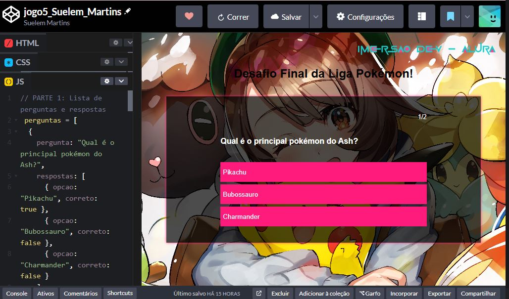

# game5_Suelem_Martins

A Pen created on CodePen.

Original URL: [https://codepen.io/SuelemMartins/pen/emYoEdW](https://codepen.io/SuelemMartins/pen/emYoEdW).

# 🎮 Imersão Alura - Jogo Pokémon

📸 **Imagem do Projeto:**  

> Jogo desenvolvido durante a **Imersão Alura**!  
> Um projeto emocionante com desafios e muita diversão. Combinando lógica e criatividade, este jogo é uma demonstração das habilidades adquiridas em **JavaScript**, **HTML**, **CSS** e **JSON**. 💻✨

---

## 🧩 Módulos do Projeto

### 🔹 Interface (HTML + CSS)
- Criação da estrutura visual do jogo com HTML.
- Estilização personalizada inspirada no universo Pokémon usando CSS.

### 🔹 Lógica do Jogo (JavaScript)
- Manipulação dinâmica dos elementos da tela.
- Sistema de cartas com atributos como `ataque`, `defesa` e `magia`.
- Comparação de atributos entre cartas do jogador e da máquina.

### 🔹 Dados (JSON)
- Uso de objetos JavaScript (formato JSON) para armazenar as cartas.
- Facilidade para expandir o baralho com novas cartas futuramente.

---

## 🧠 Desafios Enfrentados

Durante a criação do jogo, enfrentei desafios como:
- Estruturar os dados de forma que fosse fácil manipular.
- Criar uma lógica justa para o jogo da máquina versus jogador.
- Tornar a interface responsiva e intuitiva.

Cada obstáculo foi uma oportunidade de aprendizado e crescimento! 🚀

## 🛠️ Tecnologias Utilizadas

- HTML5
- CSS3
- JavaScript (puro)
- Estrutura de dados com JSON
- Git e GitHub

---

## 🙋‍♀️ Sobre mim

Curiosa, dedicada e apaixonada por tecnologia. Este projeto é uma pequena amostra do que sou capaz de construir com criatividade e código! 💙

